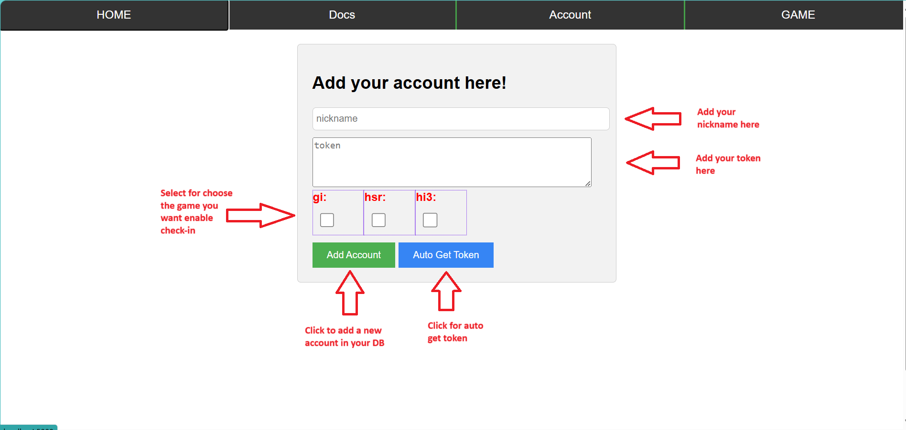
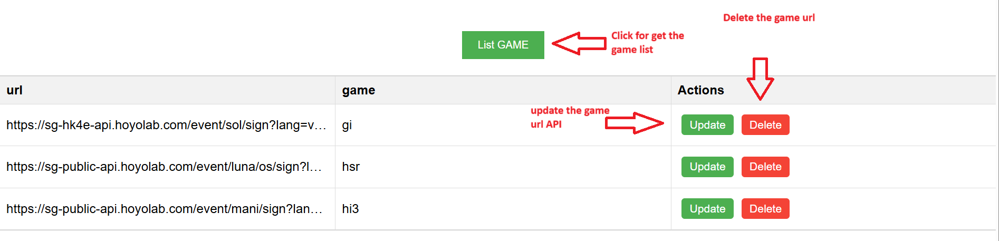
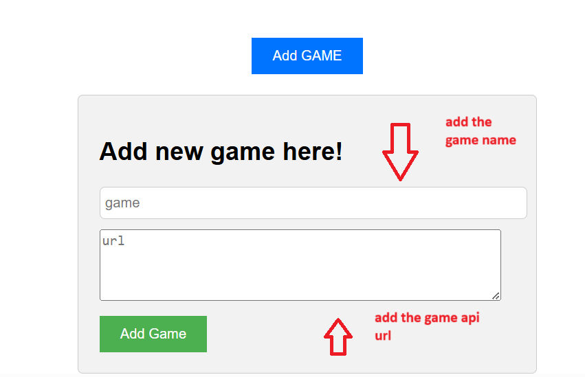
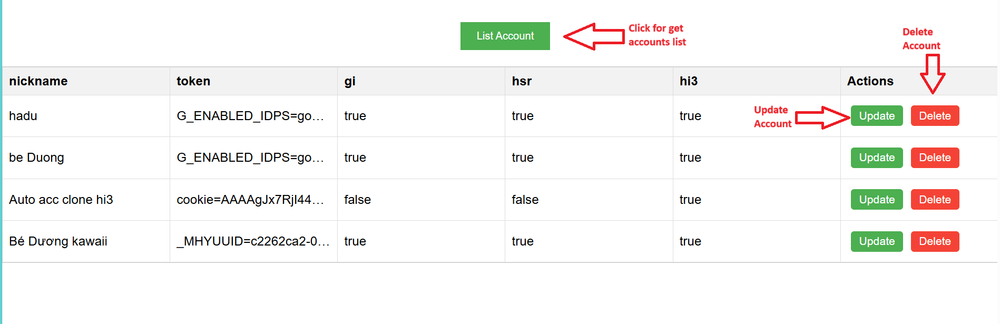
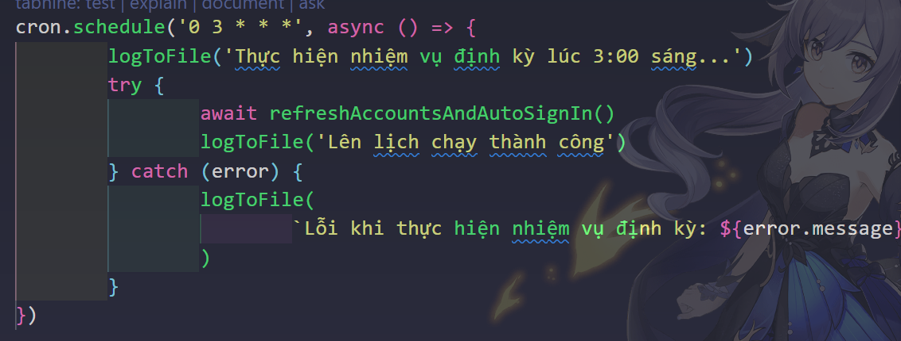
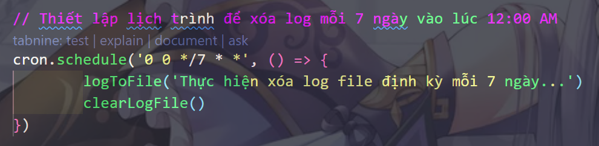

# Hoyolab AutoDaily

  

A project to help auto check-in on Hoyolab for games like Honkai Impact 3, Genshin Impact, and Honkai Star Rail.

  

## Authors

  

- [@HiraDuong](https://github.com/HiraDuong)

  

- [@haruhikawaii2k1](https://github.com/haruhikawaii2k1)

  

## Table of Contents

  

- [Introduction](#introduction)

  

- [Features](#features)

  

- [Installation](#installation)

  

- [Usage](#usage)

  

- [Configuration](#configuration)

  

- [Acknowledgements](#acknowledgements)

  

## Introduction

  

[Provide a brief introduction about the project.]

  

## Features

  

- Automatic check-in for Hoyolab games.

  

- Supports Honkai Impact 3, Genshin Impact, and Honkai Star Rail.

  

## Installation

  

1. Clone the repository:

```bash
git  clone  https://github.com/HiraDuong/hoyolab-auto-daily.git
```

2. Navigate to the project directory:
```bash
cd  hoyolab-auto-daily
```

3. Install the dependencies:
```bash
npm  install
```

4. Create a `.env` file and add your configuration settings:

```env
MONGO_URI=your_mongodb_uri
PORT=5000
```

- If you don't know how to get your your_mongodb_uri, see the [Configuration](#configuration)

  

## Usage

  

1. Run the project: `bash npm start`

  

2. Access the application using your VPS IP or localhost with port 5000. For example:

  

-  **For VPS (Virtual Private Server):**  `<VPS_IP_ADDRESS>:5000`

  

-  **For Localhost:**  `localhost:5000`

  

- In this usage example, we will use \*\*  `localhost:5000` for represent

  

3. Add an account

  

- Go to \*\*  `localhost:5000` you will see this UI

  

<<<<<<< Updated upstream
- 
=======
- 
>>>>>>> Stashed changes

  

4. Add update or delete a new game (like as ZZZ)

  

- Go to \*\*  `localhost:5000/game` you will see this UI

  

<<<<<<< Updated upstream
- 

  

- 
=======
- 

  

- 
>>>>>>> Stashed changes

  

5. Update or Delete an account

  

- Go to \*\*  `localhost:5000/account` you will see this UI

  

<<<<<<< Updated upstream
- 
=======
- 
>>>>>>> Stashed changes

  

## Configuration

  

- Schedule check-in time

<<<<<<< Updated upstream
- 

- Schedule delete the log time

- 
=======
- 

- Schedule delete the log time

- 
>>>>>>> Stashed changes

- Get your MongoDB uri here [Get Started with Atlas - MongoDB Atlas](https://www.mongodb.com/docs/atlas/getting-started/)

  

## Acknowledgements

  

- Special thanks to Hoyolab and the developers of the supported games.

  

- Thanks to the open-source community for their contributions and support.